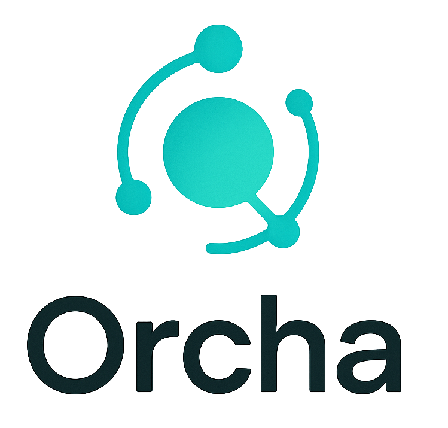

  
  
  

    A visual workflow automation platform that connects services and orchestrates complex processes without heavy code.
  

---

## Overview

**Orcha** is a workflow automation engine that connects APIs, services, and internal tools into visual, event-driven flows. It lets teams orchestrate complex processes with modular nodes, custom logic, and integrations, all without heavy scripting. Designed for scale and extensibility, it streamlines data movement, task automation, and service coordination across your stack.

